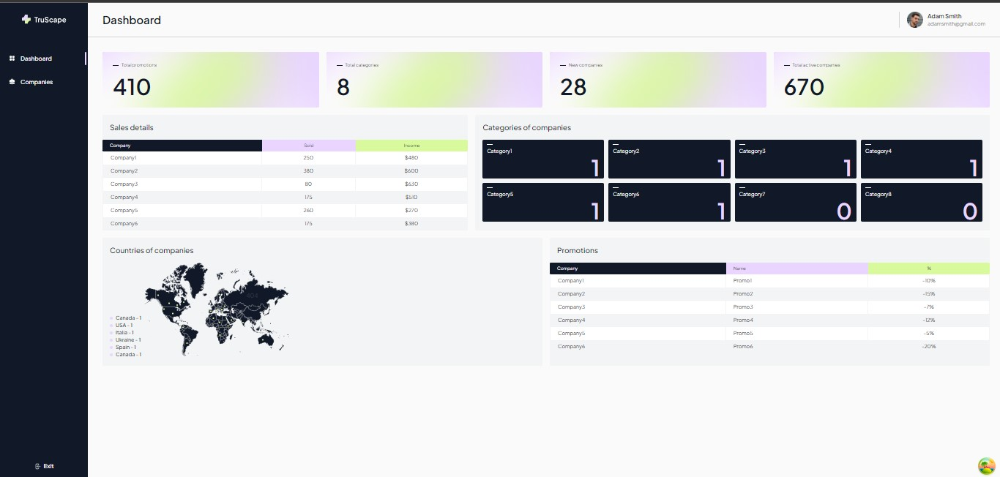

## ℕ𝕖𝕩𝕥 ℂℝ𝕄  
  

This is a [Next.js](https://nextjs.org/) project bootstrapped with [`create-next-app`](https://github.com/vercel/next.js/tree/canary/packages/create-next-app).  

## 𝔽𝕖𝕒𝕥𝕦𝕣𝕖𝕤 𝕒𝕟𝕕 𝕋𝕖𝕔𝕙𝕟𝕠𝕝𝕠𝕘𝕚𝕖𝕤 ᎓  

</a>&nbsp;
  &nbsp;
  &nbsp;
  &nbsp;
  &nbsp;
  &nbsp;
  &nbsp;
  &nbsp;  

※ Working with server and client components.  

※ Next.js: React framework for building full-stack web applications.  
※ React query & devtools: for managing, caching, and syncing asynchronous and remote data in React.   
※ Tailwind CSS: a framework for rapidly building modern websites.  
※ TypeScript: for strict typing of data types.  
※ clsx: for conditional application of a given class name.  
※ Formik: form library for React.  
※ Quick Mocker: for backend data.  

## 𝕀𝕟𝕤𝕥𝕒𝕝𝕝𝕒𝕥𝕚𝕠𝕟 ᎓ 

To get started with this project, follow the installation instructions below.

1. Clone the repository:
   ```bash
   git clone https://github.com/Morifer79/next-project_crm.git
   cd next-project_crm-app
   ```
2. Install the dependencies:
   ```bash
   npm install
   ```
3. Start the development server:
   ```bash
   npm start
   ```
4. Open to view it in the browser:  
<a href="https://morifer79.github.io/next-project_crm/"></a>  

## Email me :  
Questions, suggestions, help:  
<a href="mailto:cyber-morifer@proton.me"></a>
